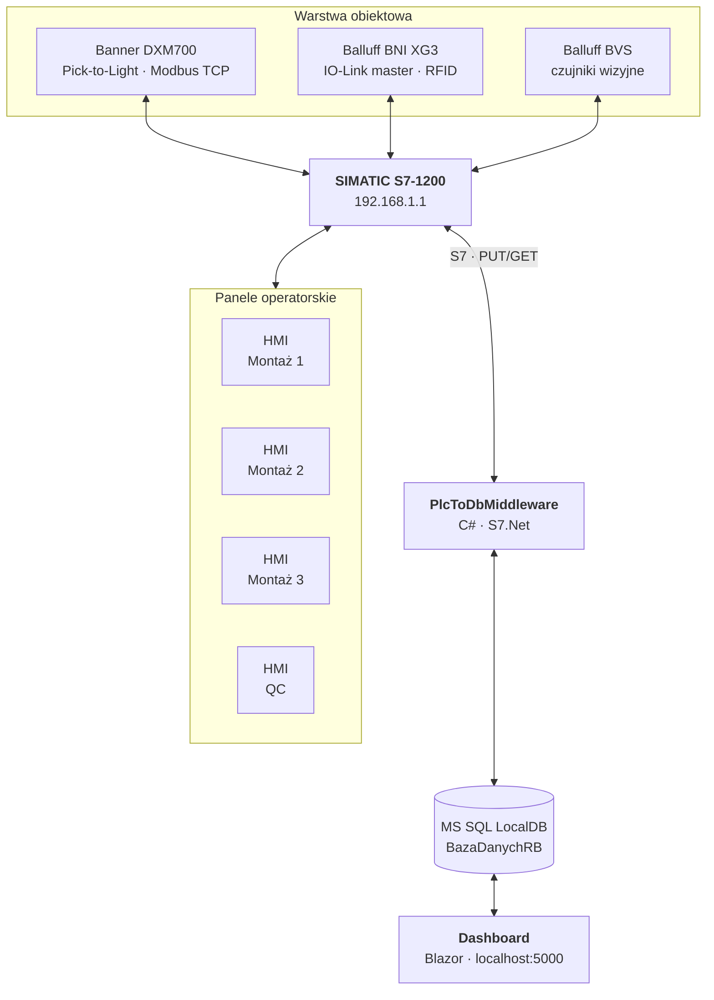
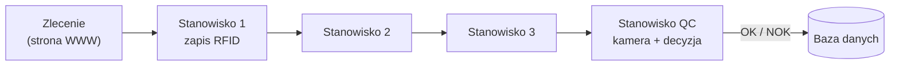
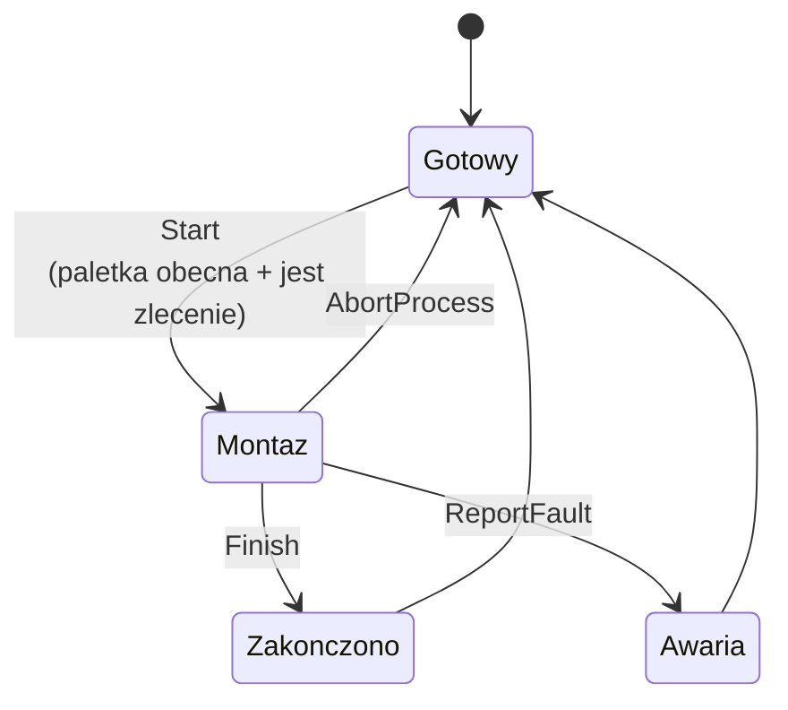
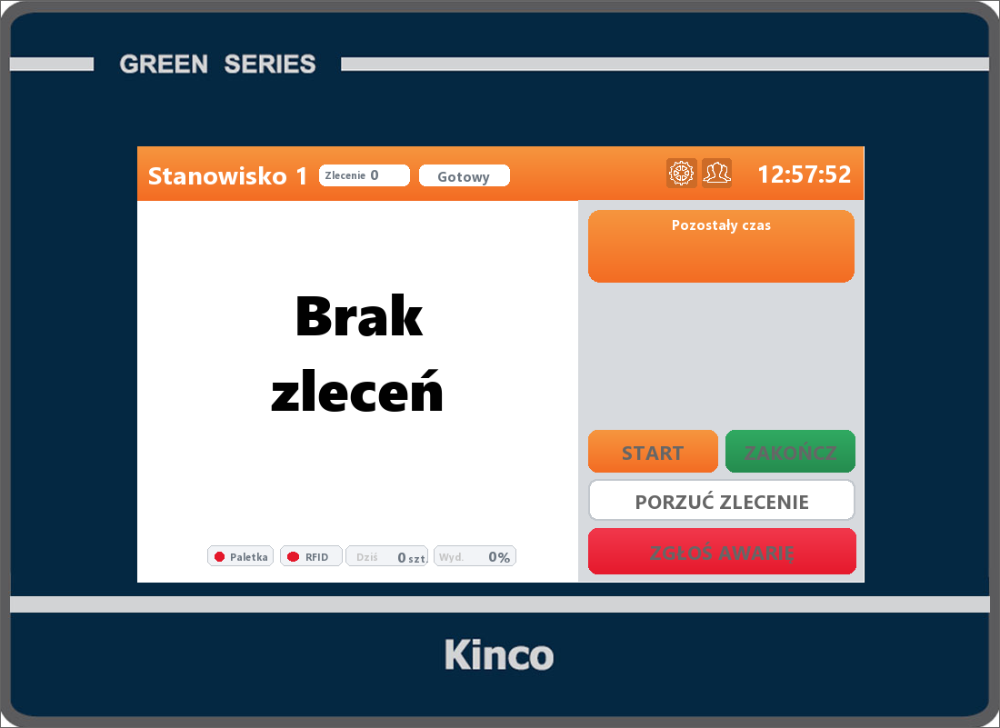
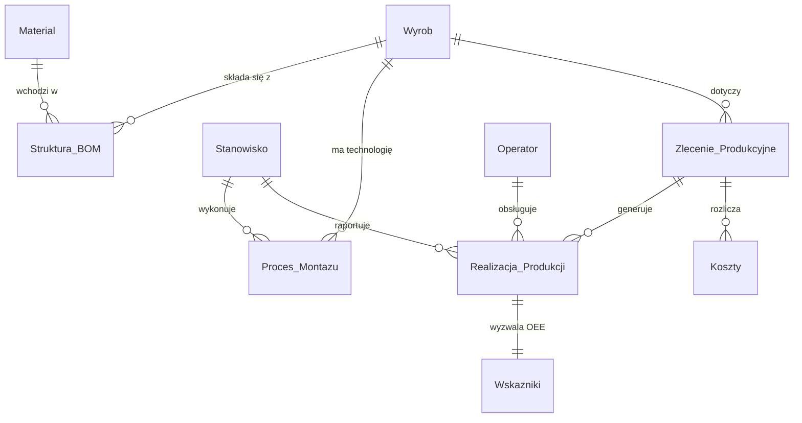
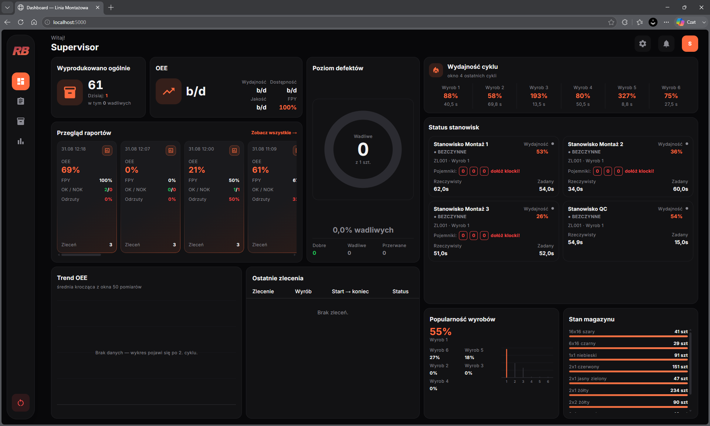

# Linia montażowa LEGO

Zautomatyzowana, czterostanowiskowa linia montażowa modeli LEGO — projekt zespołowy
łączący sterowanie PLC, panele operatorskie, identyfikację RFID, kontrolę wizyjną
oraz nadrzędny system MES z bazą danych i aplikacją webową.

Linia realizuje pełny cykl produkcyjny: zlecenie utworzone na stronie trafia do
sterownika, przechodzi przez trzy stanowiska montażowe i stanowisko kontroli
jakości, a wyniki (czasy cykli, braki, zużycie komponentów, OEE) wracają do bazy
i są prezentowane na dashboardzie.

> 📷 **[do uzupełnienia]** `docs/zdjecia_linii/linia_ogolny_widok.jpg` — ogólny widok linii

---

## Spis treści

- [Architektura](#architektura)
- [Struktura repozytorium](#struktura-repozytorium)
- [Uruchomienie](#uruchomienie)
- [Warstwa PLC](#warstwa-plc)
- [Panele operatorskie (HMI)](#panele-operatorskie-hmi)
- [Baza danych](#baza-danych)
- [Middleware](#middleware)
- [Aplikacja webowa](#aplikacja-webowa)
- [Sprzęt i adresacja IP](#sprzęt-i-adresacja-ip)
- [Konstrukcja mechaniczna](#konstrukcja-mechaniczna)

---

## Architektura

System składa się z trzech warstw: obiektowej (sterownik i urządzenia peryferyjne),
pośredniej (middleware C#) oraz nadrzędnej (baza danych + aplikacja webowa).



Przepływ produkcji jest sekwencyjny — paletka z tagiem RFID przechodzi kolejno
przez wszystkie cztery stanowiska:



---

## Struktura repozytorium

```
CAD/                    modele 3D elementów konstrukcyjnych (.step)
HMI/                    projekt paneli operatorskich
  Assets/                 grafiki instrukcji montażu
  Visualization/          projekt wizualizacji
PLC/
  Program_PLC_LEGO/       projekt TIA Portal
  zrodla/                 eksport źródeł do dokumentacji
    scl/                    bloki programu (16 plików)
    db/                     bloki danych (7 plików)
    udt/                    typy danych (3 pliki)
    Main.pdf                wydruk OB1
SQL/                    skrypty tworzące i migrujące bazę
WEB/
  Dashboard/              aplikacja Blazor
  Middleware/             most PLC ↔ baza
docs/
  baza_csv/               eksport zawartości bazy (25 tabel)
  screeny_hmi/            zrzuty z paneli operatorskich
  screeny_web/            zrzuty z dashboardu
  zdjecia_linii/          zdjęcia fizycznej linii
Uruchom_Linie.ps1       start całego systemu
Zatrzymaj_Linie.ps1     zatrzymanie
Eksport_Bazy.ps1        zrzut bazy do CSV
```

---

## Uruchomienie

### Wymagania

| Składnik | Wersja / uwagi |
|---|---|
| .NET SDK | 10.0 |
| MS SQL LocalDB | instancja `MSSQLLocalDB` |
| Windows PowerShell | 5.1 |
| TIA Portal | V18 (tylko do edycji programu PLC) |

### Pierwsze uruchomienie

1. Utwórz bazę — wykonaj skrypty z katalogu `SQL/` **w kolejności numerycznej**:

   ```
   01_CreateDatabase.sql
   02_AddLoginColumns.sql
   03_DB_Migration_002.sql
   04_TRG_Calculate_OEE.sql
   ```

2. Wgraj program do sterownika z TIA Portal (projekt `PLC/Program_PLC_LEGO`).

3. Uruchom system:

   ```powershell
   .\Uruchom_Linie.ps1
   ```

Skrypt podnosi po kolei LocalDB, middleware i dashboard, przekierowuje ich
wyjście do katalogu `logs\` i otwiera przeglądarkę na `http://localhost:5000`.

**Przydatne przełączniki:**

| Przełącznik | Działanie |
|---|---|
| `-Buduj` | wymusza `dotnet build` obu projektów |
| `-Restart` | ubija działające instancje i stawia je od nowa |
| `-BezPrzegladarki` | nie otwiera przeglądarki |

Zatrzymanie: `.\Zatrzymaj_Linie.ps1`

> **Uwaga:** nie uruchamiaj skryptu jako administrator — LocalDB jest instancją
> użytkownika i przy podniesionych uprawnieniach middleware trafi do innej bazy
> niż dashboard.

Brak połączenia ze sterownikiem **nie jest błędem krytycznym** — middleware
ponawia łączenie co 5 sekund, a strona działa dalej na danych z bazy.

---

## Warstwa PLC

Logika produkcyjna napisana w SCL na sterowniku SIMATIC S7-1200. Źródła wyeksportowane
z TIA Portal znajdują się w `PLC/zrodla/`. Blok `Main` zawiera wywołania gotowych bloków
producentów urządzeń, więc pozostał w języku drabinkowym i nie podlega eksportowi do `.scl` —
jest dołączony jako wydruk `PLC/zrodla/Main.pdf`.

### Bloki programu

| Blok | Rola |
|---|---|
| `Main` (OB1) | obsługa czytników RFID wszystkich stanowisk i sekwencji kamery — jedyny blok w LAD, dlatego dołączony jako `Main.pdf`, a nie `.scl` |
| `Stanowisko1..3.scl` | maszyny stanów stanowisk montażowych |
| `StanowiskoQC.scl` | maszyna stanów kontroli jakości |
| `Czujniki.scl` | odczyt czujników obecności paletki, RFID i przycisków Pick-to-Light (Modbus TCP) |
| `Kontenery.scl` | logika liczników kontenerów z komponentami |
| `RaportowanieDB.scl` | przygotowanie danych dla middleware |
| `ResetZlecen.scl` | kasowanie tablicy zleceń |
| `Startup.scl` | OB startowy — inicjalizacja kamery |
| `BVS_Sensor*.scl` | obsługa czujników wizyjnych Balluff |
| `BIS_V_CLM_COM*.scl` | obsługa RFID Balluff |

### Bloki danych

| Blok | Zawartość |
|---|---|
| `DB_Data` | stany, komendy, liczniki i dane HMI wszystkich czterech stanowisk |
| `DB_Zlecenia` | tablica 200 zleceń + sloty `NastepneZlecenie` i `PusteZlecenie` |
| `DB_PTL` | stan przycisków Pick-to-Light i parametry połączenia Modbus |
| `DB_WWW` | powierzchnia wymiany danych z middleware |
| `DB_Cam_Input` / `DB_Cam_Output` | bufory komunikacji z kamerą |
| `RFID_test` | bufory odczytu i zapisu tagów |

Bloki są **niezoptymalizowane** (`S7_Optimized_Access = FALSE`) z włączonym
PUT/GET — inaczej panele HMI i middleware nie widzą adresów absolutnych.

### Maszyna stanów stanowiska montażowego



Stan `Montaż` dzieli się wewnętrznie na trzy podstany (`MontazState`):

0. wczytanie danych zlecenia, ustawienie czasów docelowych, zapis tagu RFID
1. inicjalizacja licznika czasu
2. odliczanie w dół, miganie wyświetlacza po przekroczeniu czasu docelowego

Stanowisko QC ma analogiczną strukturę, z tą różnicą, że w podstanie 0 **odczytuje**
tag RFID (zamiast go zapisywać), wyszukuje zlecenie w tablicy 200 slotów i zleca
inspekcję kamerze. Zakończenie następuje przyciskiem OK albo NOK — przy NOK
operator wskazuje powód (brak klocka, zły kolor, przesunięcie, uszkodzenie,
zła liczba, inne), który zapisuje się w strukturze zlecenia.

> 📷 **[do uzupełnienia]** `docs/zdjecia_linii/stanowisko_qc.jpg` — stanowisko kontroli jakości z kamerą Balluff BVS nad paletką

### Wyroby i czasy montażu

Czasy docelowe są zaszyte w `Stanowisko1.scl` i zdublowane w tabeli
`Proces_Montazu` w bazie. Numeracja modeli w PLC jest przesunięta o 1 względem
bazy (wartości 0–1 są zarezerwowane na informacje sterujące).

| Model (PLC) | Wyrób (baza) | St. 1 | St. 2 | St. 3 | QC | Suma |
|---|---|---|---|---|---|---|
| 2 | Wyrób 1 | 54 s | 60 s | 52 s | 15 s | 181 s |
| 3 | Wyrób 2 | 39 s | 42 s | 66 s | 15 s | 162 s |
| 4 | Wyrób 3 | 26 s | 82 s | 59 s | 15 s | 182 s |
| 5 | Wyrób 4 | 27 s | 29 s | 53 s | 15 s | 124 s |
| 6 | Wyrób 5 | 30 s | 33 s | 55 s | 15 s | 133 s |
| 7 | Wyrób 6 | 20 s | 33 s | 43 s | 15 s | 111 s |

> 📷 **[do uzupełnienia]** `docs/zdjecia_linii/wyroby.jpg` — sześć gotowych modeli obok siebie

### Pick-to-Light

Sterownik odpytuje bramkę Banner DXM700 przez Modbus TCP (`MB_CLIENT`,
rejestry 40017–40025) i czyta stan 9 przycisków — po trzy na każde stanowisko
montażowe. Wykrycie zbocza narastającego zmniejsza licznik odpowiedniego
kontenera. Operator może też skorygować stan ręcznie z panelu HMI
(przyciski `Add` / `Subtract`, zakres 0–3).

---

## Panele operatorskie (HMI)

Cztery panele — po jednym na każde stanowisko. Każdy udostępnia ekran startowy,
ekran roboczy z instrukcją montażu i licznikiem czasu, zakładkę ustawień
(m.in. kasowanie licznika `Done Today`), okno awarii oraz zakładkę autorów.

| Stanowisko montażowe | Stanowisko QC |
|---|---|
|  |  |

Pozostałe zrzuty: [`docs/screeny_hmi/`](docs/screeny_hmi/)

Instrukcje montażu to grafiki rzutu z góry (`HMI/Assets/`) — po trzy warianty
na wyrób dla każdego stanowiska, przełączane na podstawie numeru modelu
odczytanego z tagu RFID.

> 📷 **[do uzupełnienia]** `docs/zdjecia_linii/stanowisko_montazowe.jpg` — stanowisko z panelem, kontenerami i listwą Pick-to-Light

---

## Baza danych

MS SQL LocalDB, baza `BazaDanychRB`. Schemat obejmuje 11 tabel głównych
(plus tabele pomocnicze utworzone w migracjach) powiązanych kluczami obcymi.



Kluczowe elementy:

- **`Struktura_BOM`** — lista komponentów każdego wyrobu z przypisaniem do stanowiska (54 pozycje).
- **`Proces_Montazu`** — czasy jednostkowe operacji dla par wyrób–stanowisko.
- **`TRG_Realizacja_OEE`** — wyzwalacz na `Realizacja_Produkcji`, który po każdym
  zarejestrowanym cyklu automatycznie wylicza i zapisuje do tabeli `Wskazniki`:
  wydajność, dostępność, jakość, **OEE**, FTY oraz wydajność pracy operatora.
- **Magazyn komponentów** — rezerwacje pod zlecenie, zużycie na stanowisku
  i zwroty po odrzucie NOK; dopuszczalne jest „zadłużenie" (stan ujemny),
  gdy zlecenie zatwierdzono mimo braków.

Aktualny zrzut zawartości: [`docs/baza_csv/`](docs/baza_csv/) — generowany
skryptem `Eksport_Bazy.ps1`.

---

## Middleware

`WEB/Middleware` (`PlcToDbMiddleware`) — konsolowa aplikacja C# pośrednicząca
między sterownikiem a bazą. Odpytuje PLC co 200 ms przez bibliotekę S7.Net.

Odpowiada za:

- podawanie sterownikowi kolejnych zleceń z kolejki SQL,
- rejestrację sztuk po kontroli jakości wraz z powodem odrzutu,
- zapis czasów cykli, stanów stanowisk i liczników kontenerów,
- rozliczanie zużycia komponentów magazynowych,
- obsługę żądań resetu tablicy zleceń.

Dwa mechanizmy zabezpieczające, warte odnotowania:

**Walidacja układu pamięci przy starcie.** Offsety w `DB_Zlecenia` zależą od
rozmiaru `udtZlecenia`. Rekord rósł już dwukrotnie (138 → 140 → 142 bajtów),
a każdy taki wzrost przesuwa całą mapę o 200 × delta. Zapisy trafiałyby wtedy
w losowe miejsce, **pozornie się udając**. Middleware sprawdza to przy starcie
i zgłasza rozjazd w logu, zamiast po cichu psuć dane.

**Odporność na zerwane połączenie.** Wyjątek z sesji S7 nie kończy pracy
programu — po każdym zerwaniu middleware wstaje od nowa. Mutex globalny
blokuje uruchomienie drugiej instancji, która biłaby się o ten sam sterownik
i tę samą bazę.

---

## Aplikacja webowa

`WEB/Dashboard` — aplikacja Blazor (MudBlazor) na `http://localhost:5000`.

| Widok | Zawartość |
|---|---|
| **Dashboard** | OEE z rozbiciem na dostępność / wydajność / jakość, liczniki produkcji, status stanowisk na żywo, trend OEE, przyczyny postojów, popularność wyrobów |
| **Zlecenia** | tworzenie i edycja zleceń, priorytety z preempcją, walidacja dostępności komponentów |
| **Magazyn** | stan komponentów, rezerwacje, transakcje, ręczna korekta, sygnalizacja braków |
| **Raporty** | zestawienia produkcyjne z zakresem dat |



Pozostałe zrzuty: [`docs/screeny_web/`](docs/screeny_web/)

---

## Sprzęt i adresacja IP

| Urządzenie | Adres IP | Model |
|---|---|---|
| Sterownik PLC | `192.168.1.1` | SIMATIC S7-1200 |
| Panel HMI — Montaż 1 | `192.168.1.10` | |
| Panel HMI — Montaż 2 | `192.168.1.11` | |
| Panel HMI — Montaż 3 | `192.168.1.12` | |
| Panel HMI — QC | `192.168.1.13` | |
| Master IO-Link | `192.168.1.20` | Balluff BNI XG3-508-0B5-R067 |
| Bramka Pick-to-Light | `192.168.1.30` | Banner DXM700 |
| Kamera kontroli jakości | `192.168.1.40` | Balluff BVS |

> **Uwaga historyczna:** DXM700 miał pierwotnie adres `192.168.1.20`, co
> kolidowało z masterem Balluff. Konflikt rozwiązano przenosząc bramkę na `.30`.

> 📷 **[do uzupełnienia]** `docs/zdjecia_linii/szafa_sterownicza.jpg` — szafa ze sterownikiem, masterem IO-Link i bramką DXM

Dane logowania do urządzeń **nie są przechowywane w repozytorium** — należy je
uzyskać od opiekuna projektu.

---

## Konstrukcja mechaniczna

Rama linii wykonana z profili aluminiowych (projekt zewnętrzny — Alutec).
Elementy zaprojektowane w ramach projektu i wykonane w technologii druku 3D
znajdują się w katalogu [`CAD/`](CAD/):

| Plik | Element |
|---|---|
| `paletka.step` | paletka transportowa z gniazdem na tag RFID |
| `uchwyt_hmi.step` | uchwyt panelu operatorskiego |
| `podstawa_czujnikow.step` | podstawa pod czujniki obecności |
| `mocowanie_kamery.step` | mocowanie kamery na stanowisku QC |
| `zderzak_gorny.step`, `zderzak_dolny.step` | zderzaki pozycjonujące paletkę |
| `lacznik_usztywniajacy.step` | łącznik usztywniający ramę |
| `organizer_przewodow_*.step` | organizery okablowania |
| `cyfra_1..3.step`, `napis_rizz_bricks.step` | oznaczenia stanowisk i logo zespołu |
| `linia_montazowa_alutec.step` | model końcowy całej linii |

> 📷 **[do uzupełnienia]** `docs/zdjecia_linii/paletka_rfid.jpg` — paletka z tagiem RFID

---

## Autorzy

Projekt zespołowy — Politechnika Poznańska, kierunek Mechatronika.

<!-- TODO: uzupełnić skład zespołu i podział prac -->

## Licencja

GNU General Public License v3.0 — zobacz [LICENSE](LICENSE).
